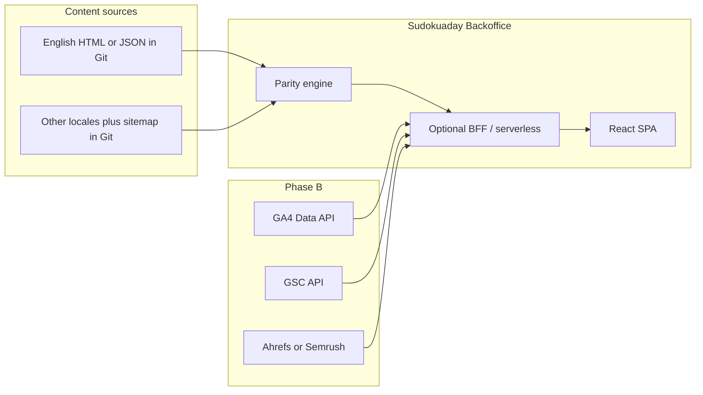

# Sudoku a Day — Backoffice Plan

A React-based internal tool for **sudokuaday.com** to monitor **translation parity** (all locales aligned with English) and, in a later phase, to consolidate **analytics and SEO** signals from external APIs.

---

## 1. Goals

| Priority | Goal                                                                                                                                                    |
| -------- | ------------------------------------------------------------------------------------------------------------------------------------------------------- |
| P0       | **Language parity**: Surfaces where non-English content diverges from English (missing keys, stale strings, structural mismatches, URL/slug alignment). |
| P1       | **Operational clarity**: One place to see “what needs attention” per locale, with filters and exports.                                                  |
| P2       | **Analytics & SEO (later)**: Read-only dashboards fed by Google Analytics, Google Search Console, and Ahrefs or Semrush.                                |

**Principle:** English is the **source of truth**. Every other locale is compared against it, not the other way around.

**Safety (non-negotiable):** **[sudokuaday.com](https://sudokuaday.com)** is **high-growth and business-critical**. This backoffice must **not** be able to break, overwrite, or degrade the live site by accident. Treat it as **read-only with respect to production**: ingest and report only; **no** direct writes to the site repo, **no** deploy triggers, and **no** customer-facing coupling from the backoffice stack (see **§7.2**). Any future automation that touches Git or hosting must go through **explicit, reviewed** flows (for example pull requests only), never silent mutation from a dashboard button.

**Confirmed for sudokuaday.com (update if this changes):** The public site is **static HTML** (no app database). **Source of truth is the GitHub repository** **[github.com/jipvandervelde/sudokuaday.com](https://github.com/jipvandervelde/sudokuaday.com)** (public). HTML pages, **locale mirrors**, and `**sitemap.xml`** all live in that repo. The backoffice should ingest from **Git**, not from scraping production.

---

## 2. Users & Success Criteria

- **Content / localization owners** can open the backoffice and within minutes know: which locales are behind, what is missing, and where to fix it.
- **You (product)** can extend the same app with API-backed metrics without rewriting the parity layer.

**Success looks like:** fewer “silent” translation gaps, faster audits before releases, and eventually a single pane for traffic + rankings next to content health.

---

## 3. Product Scope

### 3.1 Phase A — Parity with English (MVP)

**Ingestion** — For this project, assume **§4.0 (GitHub static site)**. Summary:

- **Translation files in the site repo** (JSON/YAML/JS modules, or parallel HTML per locale — map to a normalized key or path).
- `**sitemap.xml` (and any locale sitemaps) in the repo** — parse for URL inventory and route parity vs English.
- **Optional:** shallow HTTP checks against sudokuaday.com to confirm deployed URLs match what the repo claims (not for extracting copy).

**Comparisons to implement:**

- **Path / file parity** (primary for sudokuaday): Every English HTML path `P` should exist at `{locale}/P` for each supported locale (see §4.0); flag **missing** and **extra** locale-only pages.
- **Metadata parity**: Same `<title>`, `<meta name="description">`, canonical/hreflang patterns where applicable; optional main `<h1>` text compare.
- **Placeholder / ICU parity** (secondary): Relevant if you later extract reusable strings from HTML or introduce JSON catalogs; same tokens as English per segment.
- **Length / empty checks**: Empty or trivially short extracted fields; optional “much shorter than English” warnings (tunable thresholds).
- **Sitemap cross-check**: URLs in committed `sitemap.xml` vs files present in the repo / expected localized paths.
- **Freshness** (optional): Compare `<lastmod>` in sitemap vs Git history per path, or flag stale locales by file mtime in CI.

**UI (React):**

- **Dashboard**: Per-locale health score or counts (missing, stale, warnings).
- **Drill-down**: Table of issues with filters (locale, severity, namespace/page).
- **Diff view**: Side-by-side English vs selected locale for a key or entry (read-only first; fixes happen in **Git** on the site repo).
- **Exports**: CSV/JSON for ticketing or batch fixes.

### 3.2 Phase B — Analytics & SEO APIs

**Google Analytics (GA4)**  

- Use [Google Analytics Data API](https://developers.google.com/analytics/devguides/reporting/data/v1) with a service account or OAuth (workspace policy dependent).  
- Surfaces: sessions/users by locale, landing pages, engagement, conversions (if defined).

**Google Search Console**  

- Use [Search Console API](https://developers.google.com/webmaster-tools/v1/api_reference_index) for queries, pages, countries, devices; segment by language or path patterns where possible.

**Ahrefs or Semrush**  

- Pick **one** primary SEO vendor to avoid duplicate cost/complexity unless you need both.  
- Each exposes REST APIs with different quotas and auth; plan for: ranked keywords, backlinks snapshot, top pages, competitors (as needed).

**Backoffice role here:**  

- **Connectors** as separate modules (auth, rate limits, caching).  
- **Normalized internal model** (e.g. `metric_key`, `dimension`, `date`, `value`, `source`) so the UI does not depend on vendor-specific shapes.  
- **Caching**: Aggressive caching (and background refresh) to respect quotas and keep the UI fast.

---

## 4. How to get site contents

The backoffice should not treat **rendered HTML** on sudokuaday.com as the canonical store of copy. For sudokuaday.com, **clone or read the GitHub repo** that powers the site: that is where translations and the sitemap live. Use the live site only for **sanity checks** (HTTP status, accidental drift), not as the primary translation source.

### 4.0 GitHub static site (sudokuaday.com)

**What you have:** Static HTML, **no database**, all content and **sitemap(s)** versioned in GitHub.

| Need                           | Approach                                                                                                                                                                                                                                                                                                                                         |
| ------------------------------ | ------------------------------------------------------------------------------------------------------------------------------------------------------------------------------------------------------------------------------------------------------------------------------------------------------------------------------------------------ |
| **Human / Cursor in this IDE** | Clone **[github.com/jipvandervelde/sudokuaday.com](https://github.com/jipvandervelde/sudokuaday.com)** locally (`git clone https://github.com/jipvandervelde/sudokuaday.com`) and open it in the workspace (or as a second folder). This repo is **public**, so no token is required for read-only `git` / raw URLs.                             |
| **Backoffice CI or BFF**       | Same as any public repo: `**git clone`** in CI is enough for ingestion. If the site repo ever becomes **private**, add a **read-only** fine-grained PAT, **GitHub App** token, or **deploy key** in CI secrets — never in the React bundle. Alternatively, a workflow on the **site** repo can push a snapshot artifact to the backoffice build. |
| **Staying in sync**            | Prefer ingestion pinned to a **branch + commit SHA** (for example `main` @ `abc1234`) so reports are reproducible. On each push to the site repo, optionally trigger a **repository_dispatch** / workflow in the backoffice repo to refresh the snapshot.                                                                                        |

**Verified layout — `[jipvandervelde/sudokuaday.com](https://github.com/jipvandervelde/sudokuaday.com)`:**

- `**config.locales.json` (repo root)** — Canonical list of locales: `defaultLocale` is `**en`**, `supportedLocales` includes `en`, `nl`, `de`, `es`, `fr`, `it`, `pt`, `pt-BR`, `cs`, `da`, `pl`, `sv`, `ja`, `hi`, `ru`, `vi`, `id`, `lv`, `lt`, `nb`. `**pathPrefixByLocale`** maps each code to the URL prefix (English is `""`; others are `"/nl"`, `"/de"`, …). The ingest script should **read this file first** so new locales are picked up automatically.
- **English (`en`) content** — Lives at the **repository root** and in shared non-locale directories (for example `blog/`, `daily-sudoku/`, `comparison-pages/`, `printable/`, `how-to-play/`, …): `*.html` pages plus nested folders of HTML. There is **no `/en/` folder**.
- **Translated locales** — One **top-level directory per locale code** (for example `de/`, `pl/`, `pt-BR/`, `ja/`) whose **inner paths mirror** the English tree: e.g. root `benefits-of-sudoku.html` pairs with `de/benefits-of-sudoku.html`; root `blog/index.html` pairs with `pl/blog/index.html`; `daily-sudoku/2026-04-10/index.html` pairs with `nl/daily-sudoku/2026-04-10/index.html`.
- `**sitemap.xml` (repo root)** — Large single sitemap listing `**https://sudokuaday.com/...`** URLs (with locale prefixes in the path where applicable). Use it for **URL inventory**, **lastmod** hints, and cross-checking that expected localized URLs exist. Repo also includes helpers such as `add-sitemap-urls.sh` for maintaining it; `**SEO-Parity-Checklist.md`** documents human SEO parity guardrails the backoffice can complement.
- **Directories to exclude** from parity walks (tune as needed): `Backup/`, `_drafts/`, `node_modules/`, `.git/`, tooling-only paths; optionally `MD/`, `design-system/`, `docs/` unless you decide they need locale mirrors.

**Pairing rule for MVP:** For every `*.html` file under the English tree (root + allowed subfolders), derive a **canonical relative path** `P` (e.g. `sudoku-strategies/x-wing.html`). For each non-`en` locale `L` from `config.locales.json`, expect a file at `{L}/P` (with `{L}` = folder name, e.g. `pt-BR`). Report **missing**, **extra** (locale-only pages), and optionally **metadata/body diffs** (`<title>`, `<meta name="description">`, main `<h1>`, or structured text extraction).

### 4.1 Recommended order (general; sudokuaday uses #1 + #4)

1. **Site Git repository** — Submodule, workspace checkout, or `git clone` in CI. Read translation files + in-repo sitemap; emit a **normalized snapshot** (M1).
2. **Headless CMS or TMS** — Only if you later move off pure static Git; not applicable to the current “HTML + Git” model.
3. **Build or delivery artifact** — Optional if GitHub Actions already publishes a bundled JSON of strings; otherwise read files directly from the tree.
4. **Sitemap and shallow HTTP checks (supporting)** — Parse **sitemap from the repo** first (same version as the HTML you diff). Optionally compare to `https://sudokuaday.com/sitemap.xml` after deploy to catch publish drift.

### 4.2 Concrete ingestion patterns

| Source                  | How to obtain                                                   | What the parity layer needs                                                         |
| ----------------------- | --------------------------------------------------------------- | ----------------------------------------------------------------------------------- |
| **Locale files in Git** | Read JSON, YAML, PO, or XLIFF from the checkout                 | Per locale: map of `key → string`, optional `namespace` or file path                |
| **Static HTML tree**    | Walk `**/*.html`; pair files by locale dir or naming convention | Extract comparable fields (title, meta, headings) or hash body text per paired path |
| **Sitemap in repo**     | Parse committed `sitemap.xml` / index                           | List of canonical URLs per locale for route parity                                  |
| **Framework loaders**   | Only if the site adds a JS framework later                      | Same as locale files                                                                |
| **CMS documents**       | N/A for current stack                                           | —                                                                                   |
| **Spreadsheet**         | Rare fallback                                                   | Normalized key map                                                                  |

### 4.3 Automation shape

- **CI job (good default for MVP):** On a schedule or when the site repo’s `main` changes, run something like `pnpm ingest:parity` that writes `artifacts/parity-snapshot.json` (optionally named with git SHA). Publish that file as a build artifact, upload to object storage, or serve it from the backoffice BFF.
- **On-demand refresh:** A “Refresh snapshot” action in the UI calls a serverless or backend endpoint that re-runs the same ingest script (with **rate limits** and **auth**), then replaces the cached snapshot the React app reads.

### 4.4 Joining English to other locales

- **Message catalogs (JSON in repo):** English defines the **required key set**. Every other locale must provide a value for each key; extras in a locale can be flagged for cleanup.
- **Parallel HTML (sudokuaday):** English file at `**P`** (root-relative) ↔ locale file at `**{locale}/P`**. English defines the required set of paths; each supported non-`en` locale should have the same `P` unless you maintain an explicit **allowlist of locale-skipped pages** (for example unfinished sections).
- **CMS (if introduced later):** Join on **stable entry ID** or shared slug; English remains the reference shape.
- **Routes / sitemap:** Normalize URLs (strip origin, optional locale prefix) and verify each locale’s `<loc>` set matches English’s canonical path set where hreflang implies parity.

### 4.5 What to avoid

- **Scraping production HTML** for source strings: breaks on component refactors, hydration, third-party widgets, and SEO experiments.
- **One-off copy-paste from the browser** as the ingestion path: not repeatable and drifts immediately.
- **Treating Google Translate of the live page as data**: use only for informal spot checks, never as pipeline input.

### 4.6 Repo inventory checklist (before M1)

For **[github.com/jipvandervelde/sudokuaday.com](https://github.com/jipvandervelde/sudokuaday.com)**: treat `**config.locales.json` + root vs `{locale}/` mirror** as confirmed (see §4.0). Remaining manual choices: **exact exclude list** for non-content folders; whether `**daily-sudoku/** dated puzzles** require strict date-for-date parity across all locales or a relaxed rule; default **git branch** for production (typically` main`). Capture one **golden example** path (e.g. a strategy page + a blog post + a daily puzzle) for tests.

---

## 5. Technical Approach — React Stack

**Recommended baseline (adjust to team preference):**

| Layer            | Choice                                                 | Notes                                                                                                                           |
| ---------------- | ------------------------------------------------------ | ------------------------------------------------------------------------------------------------------------------------------- |
| Build            | **Vite + React + TypeScript**                          | Fast dev, good for a dedicated admin SPA.                                                                                       |
| Routing          | **React Router**                                       | Simple section-based nav (Parity, Analytics, Settings).                                                                         |
| UI               | **Existing design system** or **shadcn/ui + Tailwind** | Ship tables, filters, dialogs quickly.                                                                                          |
| Data fetching    | **TanStack Query**                                     | Caching, retries, stale-while-revalidate for APIs.                                                                              |
| Auth             | **Clerk / Auth0 / or SSO**                             | Lock the app to your org; no public access.                                                                                     |
| API              | **Small Node backend (optional)**                      | Keeps secrets off the browser; proxies GA/GSC/vendor APIs. For parity-only MVP, static JSON + serverless functions may suffice. |
| **Non-indexing** | **Headers + meta + robots.txt**                        | Configure hosting so every response discourages crawling (see §7.1). Not a substitute for auth.                                 |

**Deployment:** Vercel, Netlify, Cloudflare Pages, or internal hosting — match where you already run infra. Prefer a **separate hostname** (for example `backoffice.example.com` or an internal-only domain) that is **never linked** from sudokuaday.com marketing pages or sitemaps.

---

## 6. High-Level Architecture

- **Parity engine** can run in CI (generate a JSON report artifact) and/or on-demand in the backoffice API. Starting with **CI-generated snapshots** reduces coupling and keeps history.

---

## 7. Security & Compliance

- Treat all connectors as **privileged**; store refresh tokens / service account keys in server environment only.
- **Audit log** (who exported what) is optional but useful for GA/GSC data.
- Respect **Google API** and **SEO vendor** terms; cache responses to avoid abusive polling.

### 7.1 Search engines and public discovery (stay off Google, Bing, etc.)

**Goal:** The backoffice URL should not appear in search results. Treat this as **defense in depth**: authentication remains mandatory; blocking crawlers reduces accidental exposure if a link leaks.

| Layer                     | Action                                                                                                                                                                                                                                                   |
| ------------------------- | -------------------------------------------------------------------------------------------------------------------------------------------------------------------------------------------------------------------------------------------------------- |
| **Authentication**        | No anonymous access to the app or its API. Unauthenticated requests should return **401/403** (or a provider login page), not a full dashboard shell that crawlers could cache.                                                                          |
| **HTTP response headers** | On **all** routes (HTML, JS, API, `404`), send `X-Robots-Tag: noindex, nofollow, noarchive`. Configure at the **edge** (Vercel/Netlify/Cloudflare/nginx) so it applies even to deep links and hashed asset paths if your platform allows global headers. |
| **HTML**                  | In `index.html`, include `<meta name="robots" content="noindex, nofollow, noarchive">` as a backup for clients that do not honor `X-Robots-Tag` on the document.                                                                                         |
| `**robots.txt`**          | At the site root of the backoffice host, serve `User-agent: *` / `Disallow: /`. This is a **hint** to well-behaved crawlers; it does not secure the app.                                                                                                 |
| **Sitemaps and GSC**      | Do **not** list the backoffice hostname in any XML sitemap. If you verify the property in Google Search Console for debugging, do not submit a sitemap for it; rely on **removal tools** only if a URL was mistakenly indexed.                           |
| **Links and DNS**         | Do not link to the backoffice from public sudokuaday.com pages, footers, or `robots.txt` on the main site. Optional: use an **internal or non-obvious hostname** (still not a secret; auth + headers matter).                                            |
| **Stricter options**      | **IP allowlist**, **VPN**, or **Zero Trust** (Cloudflare Access, Tailscale Serve) so the hostname is not reachable from the open internet at all. Strongest option for a pure internal tool.                                                             |

**Checklist before launch:** Confirm headers with `curl -I https://<backoffice-host>/` and spot-check in browser devtools; search `site:<backoffice-host>` occasionally after go-live.

### 7.2 Protecting the public website (blast radius)

The site repo and traffic are **too important to risk** from tooling mistakes. Design defaults:

| Rule                                      | Rationale                                                                                                                                                                                |
| ----------------------------------------- | ---------------------------------------------------------------------------------------------------------------------------------------------------------------------------------------- |
| **Read-only site access**                 | CI/BFF clones or fetches **[jipvandervelde/sudokuaday.com](https://github.com/jipvandervelde/sudokuaday.com)** with **no push permissions**; tokens are **contents: read** at most.      |
| **No deploy or publish hooks**            | The backoffice must not trigger Netlify/Vercel/GitHub Pages builds, DNS changes, or CDN purges unless you add a **separate**, tightly scoped integration later with explicit safeguards. |
| **Analytics connectors are consume-only** | GA / GSC / SEO APIs are used to **read** metrics, not to change tags, remove URLs, or alter site configuration.                                                                          |
| **Snapshots, not live mutation**          | Parity runs produce **JSON reports and exports**; humans (or normal Git workflow) fix content in the site repo.                                                                          |
| **Isolation**                             | Backoffice failures (crashes, bad deploys, quota errors) must not affect sudokuaday.com visitors; no shared runtime with the public origin.                                              |
| **Future “edit from backoffice”**         | If ever added, require **PR-based** or **CMS** flows with review — not silent commits to `main`.                                                                                         |

---

## 8. Milestones

| Milestone | Deliverable | Status |
| --------- | ----------- | ------ |
| **M0** | Repo scaffold (Vite React TS), auth gate, nav; **noindex** + `robots.txt` (§7.1). | Done (`web/`, root `vercel.json`). |
| **M1** | Paired HTML paths + missing/extra; **metadata** diff (title, description, `h1`); sample capped in JSON for bundle size. | Done (`web/scripts/ingest-parity.mjs`). |
| **M2** | Dashboard, filters, **CSV export**, **sitemap** orphan check, `/diff` view; **GitHub Action** refreshes snapshot. | Done (`.github/workflows/ingest-parity.yml`). |
| **M3** | Freshness / history (optional); tighter structural rules. | Not started. |
| **M4** | GA4 connector + traffic by locale/path. | Not started. |
| **M5** | GSC connector + landing/query views. | Not started. |
| **M6** | Ahrefs *or* Semrush summary. | Not started. |

---

## 9. Open Decisions (to unblock M1)

1. **Production branch** of **[sudokuaday.com](https://github.com/jipvandervelde/sudokuaday.com)** (assumed `main` until you confirm).
2. **Parity strictness for `daily-sudoku/`**: require every date folder in every locale, or allow staggered rollout per locale.
3. **Exclude list** for roots that should not be mirrored (already called out: `Backup`, `_drafts`, etc.; confirm `MD/`, `design-system/`, …).
4. **Diff depth**: metadata-only (`title`, `description`, `h1`) vs full body text / checksum (heavier).
5. **Hosting & auth** for the backoffice: org SSO vs email allowlist (§7.1 still applies).

---

## 10. Out of Scope (for now)

- Adding a database or CMS to the static site (unless you later choose to).  
- Automated machine translation.  
- Public-facing pages or customer data unrelated to site operations.  
- **Unreviewed or automatic writes** to the sudokuaday.com repo, production deploys, or live SEO configuration from this app (§7.2).

---

*Document version: initial plan — iterate as sudokuaday.com’s content pipeline and API choices are confirmed.*